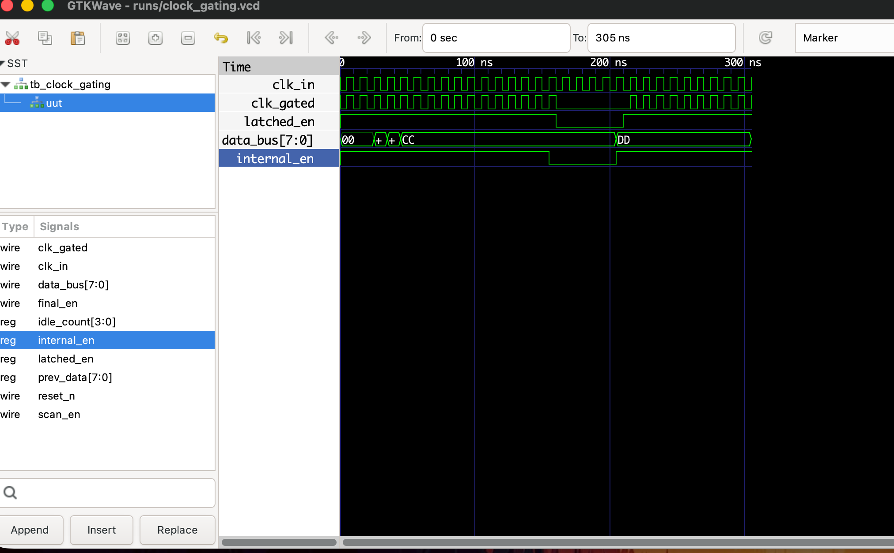

# Dynamic Clock Gating Controller

## Overview
A synthesizable Register Transfer Level (RTL) implementation of an Integrated Clock Gating (ICG) cell with an embedded activity monitor. This IP is designed to optimize dynamic power consumption (Power, Performance, Area - PPA) in System-on-Chip (SoC) environments by intelligently halting the clock to downstream modules during idle periods.

## Technical Specifications
* **Hardware Description Language:** Verilog (IEEE 1364-2005)
* **Design Domain:** Low-Power Design, ASIC/SoC Microarchitecture
* **Simulation & Verification:** Icarus Verilog
* **Waveform Analysis:** GTKWave

## Directory Structure
```text
clock_gating_controller/
├── src/                 # Synthesizable RTL source files
│   └── clock_gating_controller.v
├── tb/                  # Verification environment and testbenches
│   └── tb_clock_gating.v
├── runs/                # Simulation outputs and VCD waveform files
├── docs/                # Project documentation and diagrams
├── sim.sh               # Automated compilation and simulation script
└── README.md
```
## Microarchitecture & Silicon Considerations
A naive approach to clock gating (using a simple AND gate) introduces severe clock clipping and microscopic glitches, leading to critical setup and hold time violations in downstream flip-flops. This IP utilizes an industry-standard, glitch-free architecture.

### 1. The Activity Monitor

The controller continuously polls an 8-bit data bus. If the bus data remains entirely static for a threshold of 10 consecutive clock cycles, the monitor asserts a shutdown request (internal_en = 0). Any change in the data bus immediately resets the counter and wakes up the system.

### 2. The Glitch-Free Latch (ICG Cell)

To safely assert and de-assert the clock, the shutdown request is routed through a negative-edge-triggered latch.

When clk_in is LOW, the latch is transparent, allowing the enable signal to pass.

When clk_in is HIGH, the latch is opaque, locking the enable signal.
This ensures the gating logic only transitions when the clock is low, guaranteeing a clean, full-width clock pulse and completely eliminating physical glitches.

### 3. Design for Testability (DFT)

The module includes a scan_en input port. During post-silicon manufacturing tests, asserting this pin bypasses the activity monitor and forces the clock ON, ensuring high fault coverage during Automatic Test Pattern Generation (ATPG) and scan chain testing.

## Verification Strategy & Simulation Results

A self-checking testbench was developed to verify the glitch-free operation and the cycle-accurate triggering of the activity monitor.



*Figure 1: Simulation demonstrating the activity monitor reaching the 10-cycle threshold on static data. The `internal_en` drops, and the latch successfully synchronizes the shutdown, resulting in a flatlined `clk_gated` output with zero glitches.*
A self-checking testbench was developed to verify the glitch-free operation and the cycle-accurate triggering of the activity monitor.


## Quickstart: Running the Simulation
This repository includes an automated Bash script to compile the RTL, run the testbench, and launch the waveform viewer natively.

```bash
# Make the script executable
chmod +x sim.sh

# Execute the compilation and simulation flow
./sim.sh
```